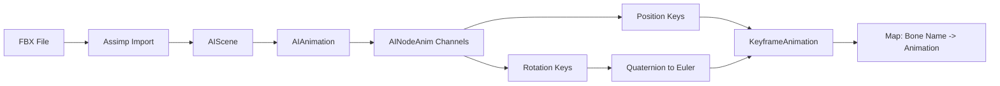

# FBXAnimationLoader Documentation

## Overview

The `FBXAnimationLoader` is a utility class responsible for loading and extracting skeletal animations from FBX (Filmbox) files. It uses the Assimp library to parse FBX files and converts the animation data into a format compatible with the game engine's animation system.

## Purpose

FBX files are a common 3D asset format that can contain models, textures, materials, and animations. This loader specifically focuses on extracting **skeletal animation data** (bone animations) from FBX files and converting them into `KeyframeAnimation` objects that can be applied to rigged characters in the game engine.

## Key Features

- **FBX File Parsing**: Uses Assimp library to read FBX files
- **Animation Extraction**: Extracts position and rotation keyframes for each bone
- **Quaternion to Euler Conversion**: Converts rotation data from quaternions to Euler angles
- **Multi-Animation Support**: Can extract specific animations by ID from files containing multiple animations
- **Scalable Coordinates**: Applies scale factors to normalize position data

## Architecture

### Dependencies

```java
import org.lwjgl.assimp.*;           // Assimp library for FBX parsing
import com.njst.gaming.Animations.KeyframeAnimation;
import com.njst.gaming.Math.Vector3;
import java.util.*;
```

### Data Flow



## Methods

### `extractAnimation(String path, int id, float scale)`

Extracts animation data from an FBX file.

**Parameters:**
- `path` - Absolute or relative path to the FBX file
- `id` - Index of the animation to extract (0-based)
- `scale` - Scale factor applied to position values (e.g., 100.0f to convert cm to m)

**Returns:**
- `Map<String, KeyframeAnimation>` - A map where:
  - **Key**: Bone name (sanitized, with `:` and `_` removed)
  - **Value**: `KeyframeAnimation` object containing keyframes for that bone

**Process:**

1. **Import FBX File**: Uses Assimp with triangulation and bone weight limiting
2. **Select Animation**: Retrieves the animation at the specified `id`
3. **Process Channels**: Iterates through each bone's animation channel
4. **Extract Position Keys**: Reads position keyframes and applies scale
5. **Extract Rotation Keys**: Reads rotation keyframes and converts quaternions to Euler angles
6. **Merge Keyframes**: Combines position and rotation data at matching timestamps
7. **Sort Keyframes**: Orders keyframes chronologically
8. **Return Map**: Returns bone-to-animation mapping

**Example Usage:**

```java
// Load animation 0 from an FBX file with 100x scale
Map<String, KeyframeAnimation> animations = 
    FBXAnimationLoader.extractAnimation("C:/jimmy/character.fbx", 0, 100.0f);

// Get animation for a specific bone
KeyframeAnimation spineAnimation = animations.get("Spine");
```

### `quaternionToEulerXYZDegrees(float x, float y, float z, float w)`

Converts a quaternion to Euler angles in XYZ order (roll, pitch, yaw).

**Parameters:**
- `x`, `y`, `z` - Quaternion vector components
- `w` - Quaternion scalar component

**Returns:**
- `float[]` - Array containing `[roll, pitch, yaw]` in degrees

**Mathematical Formulas:**

- **Roll (X-axis)**: `atan2(2(w*x + y*z), 1 - 2(x² + y²))`
- **Pitch (Y-axis)**: `asin(2(w*y - z*x))`
- **Yaw (Z-axis)**: `atan2(2(w*z + x*y), 1 - 2(y² + z²))`

**Example:**

```java
float[] euler = FBXAnimationLoader.quaternionToEulerXYZDegrees(0.0f, 0.707f, 0.0f, 0.707f);
// euler[0] = roll, euler[1] = pitch, euler[2] = yaw (all in degrees)
```

## Keyframe Timing

The loader applies a **time scaling factor** when creating keyframes:

- **Position keyframes**: `time * 10.0f` for frame lookup, `time * 5.0f` for keyframe time
- **Rotation keyframes**: `time * 10.0f` for frame lookup, `time` for keyframe time

> **Note**: This timing inconsistency may need review for proper synchronization.

## Bone Name Sanitization

Bone names are sanitized before being used as map keys:
- Removes `:` characters
- Removes `_` characters

```java
boneName.replace(":", "").replace("_", "")
```

## Common Usage Patterns

### Loading Multiple Animations

```java
// Load different animations from the same FBX file
Map<String, KeyframeAnimation> idle = 
    FBXAnimationLoader.extractAnimation("C:/jimmy/character.fbx", 0, 100.0f);
    
Map<String, KeyframeAnimation> walk = 
    FBXAnimationLoader.extractAnimation("C:/jimmy/character.fbx", 1, 100.0f);
    
Map<String, KeyframeAnimation> run = 
    FBXAnimationLoader.extractAnimation("C:/jimmy/character.fbx", 2, 100.0f);
```

### Applying to Weighted Game Objects

```java
// Load animations
Map<String, KeyframeAnimation> animations = 
    FBXAnimationLoader.extractAnimation("C:/jimmy/Defeated.fbx", 0, 100.0f);

// Load bones
Bone rootBone = FBXBoneLoader.loadBones("C:/jimmy/Defeated.fbx", animations, 1.0f);

// Create animated game object
Weighted_GameObject character = new Weighted_GameObject(
    geometry, 
    rootBone, 
    texture
);
```

## Error Handling

The loader throws a `RuntimeException` if:
- The FBX file cannot be found or loaded
- The file contains no animations
- The specified animation ID is out of bounds

```java
try {
    Map<String, KeyframeAnimation> anims = 
        FBXAnimationLoader.extractAnimation("model.fbx", 0, 100.0f);
} catch (RuntimeException e) {
    System.err.println("Failed to load animation: " + e.getMessage());
}
```

## Performance Considerations

- **Memory**: Assimp loads the entire FBX file into memory
- **Cleanup**: The loader calls `Assimp.aiReleaseImport(scene)` to free resources
- **Sorting**: Keyframes are sorted using Java streams, which may have overhead for large animations

## Limitations

1. **Single Animation**: Only loads one animation at a time (by ID)
2. **No Scaling Keys**: Does not extract scale keyframes, only position and rotation
3. **Hardcoded Time Scaling**: Time multipliers are hardcoded (10.0f, 5.0f)
4. **No Interpolation**: Does not handle interpolation between keyframes

## Best Practices

1. **Use Consistent Scale**: Keep the same scale factor across all FBX imports
2. **Cache Animations**: Load animations once and reuse them
3. **Validate Animation IDs**: Check the number of animations before loading
4. **Handle Exceptions**: Always wrap calls in try-catch blocks
5. **Release Resources**: Ensure Assimp properly releases imported scenes

## Related Classes

- [`KeyframeAnimation`](file:///c:/Users/User/Documents/jimmy/jaava/java_game_engine/java_game_engine/src/com/njst/gaming/Animations/KeyframeAnimation.java) - Stores animation keyframes
- [`FBXBoneLoader`](file:///c:/Users/User/Documents/jimmy/jaava/java_game_engine/java_game_engine/src/com/njst/gaming/Loaders/FBXBoneLoader.java) - Loads bone hierarchy from FBX
- [`Weighted_GameObject`](file:///c:/Users/User/Documents/jimmy/jaava/java_game_engine/java_game_engine/src/com/njst/gaming/objects/Weighted_GameObject.java) - Animated game objects
- [`Bone`](file:///c:/Users/User/Documents/jimmy/jaava/java_game_engine/java_game_engine/src/com/njst/gaming/Bone.java) - Bone structure for skeletal animation

## Future Improvements

- [ ] Support for scale keyframes
- [ ] Configurable time scaling factors
- [ ] Batch loading of multiple animations
- [ ] Animation blending support
- [ ] Validation of keyframe data
- [ ] Support for animation events/markers
